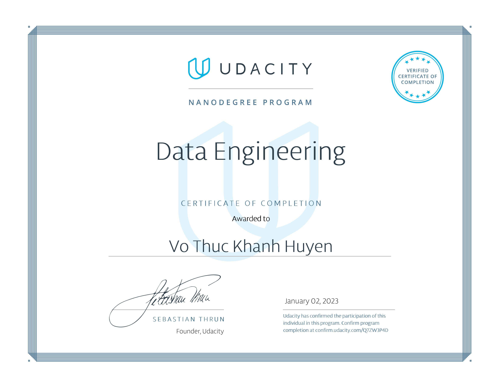

# data-engineering-nanodegree-udacity

## Overview
Learn to design data models, build data warehouses and data lakes, automate data pipelines, and work with massive datasets. At the end of the program, you’ll combine your new skills by completing a capstone project. 

## Educational Objectives: 
Learners in this program will:
- Create user-friendly relational and NoSQL data models.
- Create scalable and efficient data warehouses.
- Work efficiently with massive datasets.
- Build and interact with a cloud-based data lake.
- Automate and monitor data pipelines.
- Develop proficiency in Spark, Airflow, and AWS tools

## [Certificate](https://confirm.udacity.com/Q7ZW3P4D)
