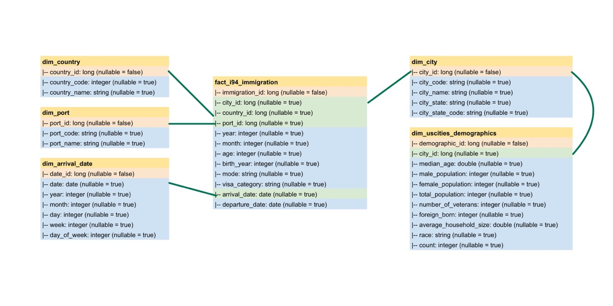

# Udacity Data Engineer Nanodegree - Capstone Project

### Project Summary
The purpose of this project is to create a data warehouse by combining immigration and demography data to create a comprehensive single-source-of-truth database.

The project follows the follow steps:

* Step 1: Scope the Project and Gather Data
* Step 2: Explore and Assess the Data
* Step 3: Define the Data Model
* Step 4: Run ETL to Model the Data
* Step 5: Complete Project Write Up

---

### Step 1: Scope the Project and Gather Data

#### 1.1. Scope 
- Data:
    - I94 Immigration Data
    - U.S. City Demographic Data
- End solution description:
    - This project builds an **ETL pipeline** for a **data lake**. We loaded data from S3, process the data into analytics tables using **Spark**, and load them back into S3.
- Tools:
    - Amazon S3
    - Apache Spark
    
#### 1.2. Describe and Gather Data 
- **I94 Immigration Data:** 
    - [Source](https://www.trade.gov/national-travel-and-tourism-office): This data comes from the US National Tourism and Trade Office.
    - Description: This dataset contains international visitor arrival statistics by world regions and select countries (including top 20), type of visa, mode of transportation, age groups, states visited (first intended address only), and the top ports of entry (for select countries).
- **U.S. City Demographic Data:**
    - [Source](https://public.opendatasoft.com/explore/dataset/us-cities-demographics/export/): This data comes from OpenSoft.
    - Description: This dataset contains information about the demographics of all US cities and census-designated places with a population greater or equal to 65,000.
    
---

### Step 2: Explore and Assess the Data

#### 2.1. Explore the Data 
Identify data quality issues, like missing values, duplicate data, etc.

#### 2.2. Cleaning Steps
Document steps necessary to clean the data

##### **I94 Immigration Data**
- Drop columns "occup", "entdepu", "insnum" which have almost null values
- Drop records that have all null columns
- Select important columns

##### **U.S. City Demographic Data**
- Drop columns having null values
- Drop duplicated samples based on "City", "State", "State Code", "Race"
- Rename columns

---

### Step 3: Define the Data Model

#### 3.1. Conceptual Data Model
- We use snowflake schema.
- The snowflake schema is similar to the star schema. However, in the snowflake schema, dimensions are normalized into multiple related tables, whereas the star schema's dimensions are denormalized with each dimension represented by a single table.

#### 3.2. Mapping Out Data Pipelines
0. Assume all data sets are stored in S3 buckets as below:
    * `[Source_S3_Bucket]/immigration/18-83510-I94-Data-2016/*.sas7bdat`
    * `[Source_S3_Bucket]/raw_data/I94_SAS_Labels_Descriptions.SAS`
    * `[Source_S3_Bucket]/raw_data/us-cities-demographics.csv`
1. Follow by Step 1 - Load the datasets
2. Follow by Step 2
    * Parsing label description file to get auxiliary tables
    * Explore and clean the datasets
3. Follow by Step 4
    * Transform i94 immigration data and us cities demographics to 1 fact table and 5 dimension tables
    * Store these tables back to target S3 bucket
    
---

### Step 4: Run Pipelines to Model the Data 

#### 4.1. Create the data model
Build the data pipelines to create the data model.

#### 4.2. Data Quality Checks
Explain the data quality checks you'll perform to ensure the pipeline ran as expected. These could include:
 * Integrity constraints on the relational database (e.g., unique key, data type, etc.)
 * Unit tests for the scripts to ensure they are doing the right thing
 * Source/Count checks to ensure completeness

#### 4.3. Data dictionary 
Create a data dictionary for your data model. For each field, provide a brief description of what the data is and where it came from.

##### **i94 immigration fact table**
- immigration_id: long (nullable = false): Immigration ID
- city_id: long (nullable = true): City ID
- country_id: long (nullable = true): Country ID
- port_id: long (nullable = true): Port ID
- year: integer (nullable = true): 4 digits year
- month: integer (nullable = true): Numeric month
- age: integer (nullable = true): Age of respondent in years
- birth_year: integer (nullable = true): 4 digits year of birth
- mode: string (nullable = true): Mode of transportation
- visa_category: string (nullable = true): Visa codes collapsed into three categories
- arrival_date: date (nullable = true): Arrival date in the USA
- departure_date: date (nullable = true): Departure date from the USA

##### **us cities demographics dimension**
- demographic_id: long (nullable = false): Demographic ID
- city_id: long (nullable = true): City ID
- median_age: double (nullable = true): Median age of the population
- male_population: integer (nullable = true): Count of male population
- female_population: integer (nullable = true): Count of female population
- total_population: integer (nullable = true): Count of total population
- number_of_veterans: integer (nullable = true): Count of total Veterans
- foreign_born: integer (nullable = true): Count of foreign residents
- average_household_size: double (nullable = true): Average city household size
- race: string (nullable = true): Respondent race
- count: integer (nullable = true): Count of city's individual per race

##### **city dimension table**
- city_id: long (nullable = false): City ID
- city_code: string (nullable = true): City code
- city_name: string (nullable = true): City name
- city_state: string (nullable = true): US state where city is located
- city_state_code: string (nullable = true): US state code where city is located

##### **port dimension table**
- port_id: long (nullable = false): Port of admission ID
- port_code: string (nullable = true): Port code
- port_name: string (nullable = true): port name

##### **country dimension table**
- country_id: long (nullable = false): country ID
- country_code: integer (nullable = true): Country code
- country_name: string (nullable = true): Country name

##### **arrival date dimension table**
- date_id: long (nullable = false): Date ID
- date: date (nullable = true): Arrival date in the USA
- year: integer (nullable = true): Arrival year
- month: integer (nullable = true): Arrival month
- day: integer (nullable = true): Arrival day of month
- week: integer (nullable = true): Arrival week
- day_of_week: integer (nullable = true): Arrival day of week

---

### Step 5: Complete Project Write Up
* Clearly state the rationale for the choice of tools and technologies for the project.
 * Apache Spark was chosen because it is capable of processing large amounts of data in various file formats, offers a fast unified analytics engine for big data, and has user-friendly APIs for working with large datasets.
* Propose how often the data should be updated and why.
    1. The tables created from the immigration and temperature data sets should be updated on a monthly basis, as the raw data is collected monthly.
    2. The tables created from the demography data set can be updated on an annual basis, as demography data collection takes time and frequent updates may be costly and could lead to incorrect conclusions.
    3. All tables should be updated in an append-only manner.
* Write a description of how you would approach the problem differently under the following scenarios:
 * The data was increased by 100x.
      * If the standalone server mode of Spark is unable to handle a data set that is 100 times larger, it may be necessary to use a distributed data cluster such as AWS EMR (Amazon Web Services Elastic MapReduce) to process the data on the cloud
 * The data populates a dashboard that must be updated on a daily basis by 7am every day.
     * Apache Airflow can be utilized to create an ETL (extract, transform, load) data pipeline that regularly updates the data and generates a report. It also has strong integration with Python and AWS, and can be used in conjunction with other tools to provide more advanced task automation capabilities.
 * The database needed to be accessed by 100+ people.
     * AWS Redshift has the capacity to support up to 500 connections. If this database will be accessed by over 100 people, it may be a good idea to consider moving it to Redshift to ensure it can handle the workload. A cost-benefit analysis should be conducted before implementing this cloud solution.