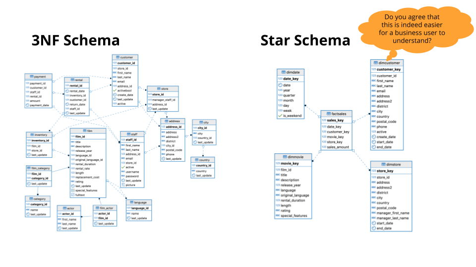

## Key Points

- What is a Data Warehouse? A Business Perspective
- What is a Data Warehouse? A Technical Perspective
- Dimensional Modeling (Recap)
- DWH Architecture
- OLAP Cubes
- DWH Storage Technology

#### What is a Data Warehouse? A Business Perspective
- You are in charge of a retailer’s data infrastructure. Let’s look at some business activities.
    - Customers should be able to find goods & make orders
    - Inventory Staff should be able to stock, retrieve, and re-order goods
    - Delivery Staff should be able to pick up & deliver goods
    - HR should be able to assess the performance of sales staff
    - Marketing should be able to see the effect of different sales channels
    - Management should be able to monitor sales growth
- Ask yourself: Can I build a database to support these activities? Are all of the above questions of the same nature?
- Let's take a closer look at details that may affect your data infrastructure.
    - Retailer has a nation-wide presence → Scale?
    -   Acquired smaller retailers, brick & mortar shops, online store → Single database? Complexity?
    - Has support call center & social media accounts → Tabular data?
    - Customers, Inventory Staff and Delivery staff expect the system to be fast & stable → Performance
    - HR, Marketing & Sales Reports want a lot information but have not decided yet on everything they need → Clear Requirements?
- Ok, maybe one single relational database won’t suffice :)

#### Operational vs Analytical Business Processes
- Operational Processes: Make it Work
    - Find goods & make orders (for customers)
    - Stock and find goods (for inventory staff)
    - Pick up & deliver goods (for delivery staff)
- Analytical Processes: What is Going On?
    - Assess the performance of sales staff (for HR)
    - See the effect of different sales channels (for marketing)
    - Monitor sales growth (for management)
- Data Warehouse is a system that enables us to support analytical processes 

#### Data Warehouse: Technical Perspective
- Extract the data from the source systems used for operations, transform the data, and load it into a dimensional model
- The Dimensional Model of a Data Warehouse 

#### Dimensional Model Review
- Goals of the Star Schema
    - Easy to understand
    - Fast analytical query performance
- Fact Tables
    - Record business events, like an order, a phone call, a book review
    - Fact tables columns record events recorded in quantifiable metrics like quantity of an item, duration of a call, a book rating
- Dimension Tables
    - Record the context of the business events, e.g. who, what, where, why, etc..
    - Dimension tables columns contain attributes like the store at which an item is purchased or the customer who made the call, etc.

- Example: The DVD Rentals Sample Database 

- Naive Extract Transform and Load (ETL): From Third Normal Form to ETL
    - Extract
        - Query the 3NF DB
    - Transform
        - Join tables together
        - Change types
        - Add new columns
    - Load
        - Insert into facts & dimension tables

#### ETL: A Closer Look
- Extracting:
    - Transfer data to the warehouse
- Transforming:
    - Integrates many sources together
    - Possibly cleansing: inconsistencies, duplication, missing values, etc..
    - Possibly producing diagnostic metadata
- Loading:
    - Structuring and loading the data into the dimensional data model

#### DWH Architecture - Kimball's Bus architecture

#### DWH Architecture - Independent Data Marts
- Departments have separate ETL processes & dimensional models
- These separate dimensional models are called “Data Marts”
- Different fact tables for the same events, no conformed dimensions
- Uncoordinated efforts can lead to inconsistent views
- Despite awareness of the emergence of this architecture from departmental autonomy, it is generally discouraged

#### DWH Architecture - Inmon's Corporate Information Factory
- 2 ETL Process
- Source systems → 3NF database
- 3NF database → Departmental Data Marts
- The 3NF database acts an enterprise-wide data store.
- Single integrated source of truth for data-marts
- Could be accessed by end-users if needed
- Data marts dimensionally modeled & unlike Kimball’s dimensional models, they are mostly aggregated

#### Best of Both Worlds: Hybrid Kimball Bus & Inmon CIF
- Removes Data Marts
- Exposes the enterprise data warehouse

#### OLAP Cubes
- Once we have a star schema, we can create OLAP cubes.
- An OLAP cube is an aggregation of at a number of dimensions
    - Movie, Branch, Month
- Easy to communicate to business users

#### OLAP Cubes: Roll Up and Drill Down
- Roll-up: Sum up the sales of each city by Country: e.g. US, France (less columns in branch dimension)
- Drill-Down: Decompose the sales of each city into smaller districts (more columns in branch dimension)

#### OLAP Cubes: Slice and Dice
- Slice: Reducing N dimensions to N-1 dimensions by restricting one dimension to a single value

- Dice: Same dimensions but computing a sub-cube by restricting, some of the values of the dimensions

#### GROUP by CUBE Statement
- Do one pass through the facts table
- Aggregate all possible combinations.

#### OLAP cubes technology
- Approach 1: Pre-aggregate the OLAP cubes and saves them on a special purpose non-relational database (MOLAP)
- Approach 2: Compute the OLAP cubes on the fly from the existing relational databases where dimentional model resides (ROLAP)

## Key Terms
- The Business Perspective on Data Warehouses
    - First, we covered the reasons why a single relational database often do not meet the needs of business users
    - Then you learned about OLTP: online transactional processing and OLAP: online analytical processing and how OLAP supports business users
- The Technical Perspective on Data Warehouses
    - In this section, we covered definitions of a Data Warehouse and ETL processes
- Dimensional Modeling
    - We reviewed how a star schema is more performant, easier for business users to understand, and supports analytical processes
    - You practiced ETL steps from a 3NF database to a Star Schema
- DWH Architecture
    - In this part of the lesson, we covered several Data Warehouse Architectures
- OLAP Cubes
    - You learned that the OLAP cube is an aggregation of data on a number of dimensions
    - You practiced slicing, dicing, Roll Up and Drill Down operations with OLAP cubes
- DWH Storage Technology
    - In the last part of the lesson you learned about Relational Online Analytical Processing (ROLAP) and using columnar storage for performance