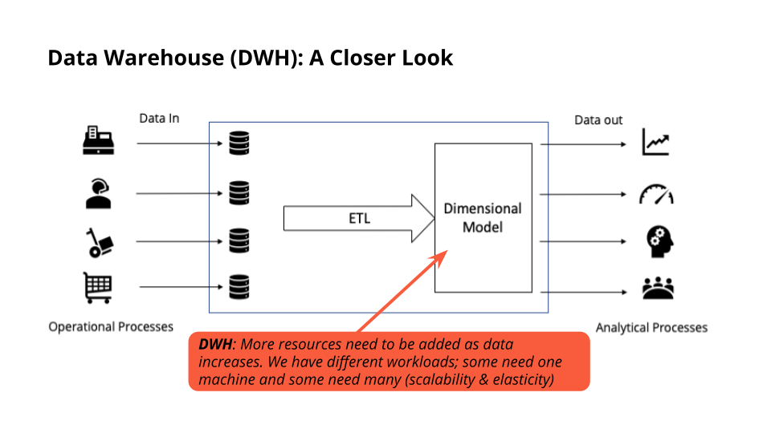
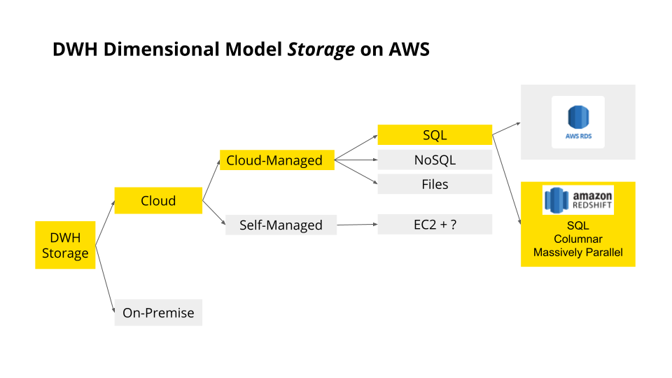
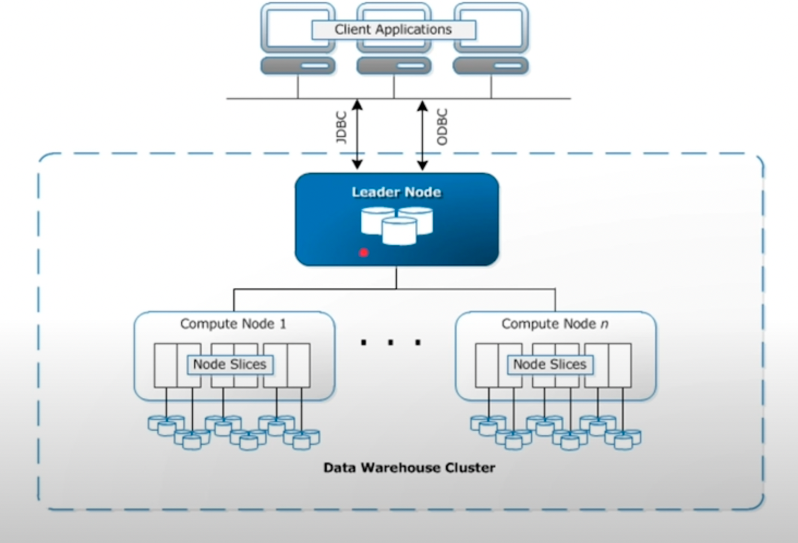
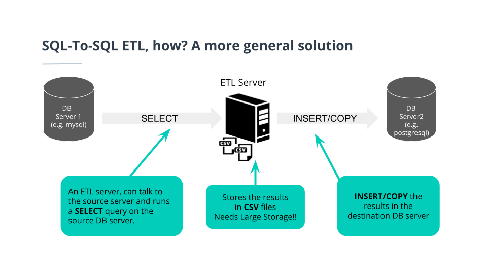
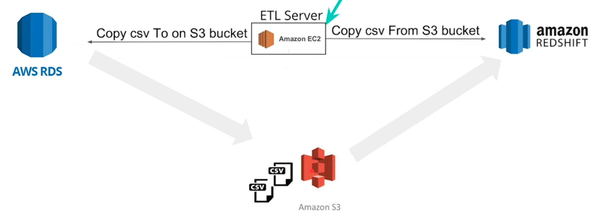
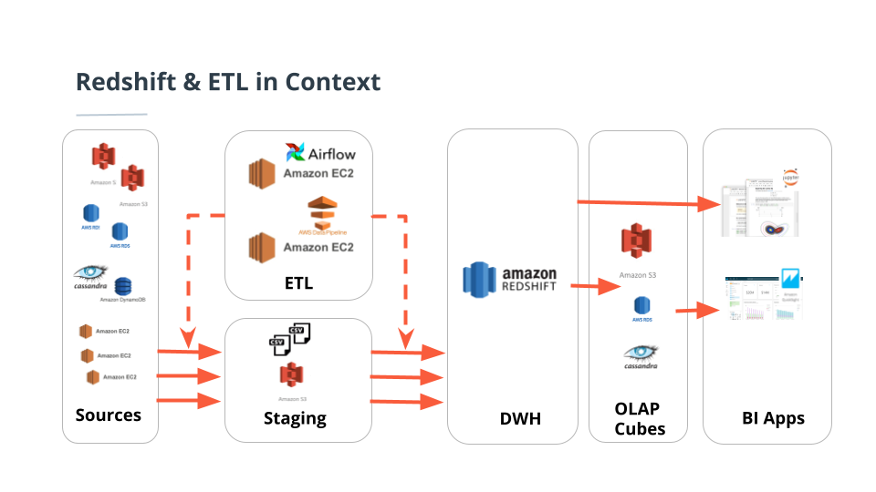

## Key Points
- Reasons to build a data warehouse in the cloud
- Architecture of Amazon Redshift
- ETL concepts on Redshift
- Building a Redshift Cluster
- Optimizing Redshift Table Design

#### Requirements for Implementation of a Data Warehouse
- Data Sources: Different types, skill sets, upgrades, locations, etc. (high heterogeneity)
- ETL: Many processes - a “grid” of machines with different schedules and pipeline complexities
- More resources need to be added as data increases. We have different workloads; some need one machine and some need many (scalability & elasticity)
- Business Intelligence Apps & Visualizations: Also need a hybrid deployment of tools for interaction, reporting, visualizations, etc.

#### Data Warehouse Implementation Choices
- On-Premise
    - Heterogeneity, scalability, elasticity of the tools, technologies, and processes
    - Need for diverse IT staff skills & multiple locations
    - Cost of ownership
- Cloud:
    - Lower barrier to entry
    - May add as you need - it’s ok to change your opinion
    - Scalability & elasticity out of the box

#### Dimensional Model Storage on AWS
- Cloud-Managed
    - Amazon RDS, Amazon DynamoDB, Amazon S3
    - Re-use of expertise; way less IT Staff for security, upgrades, etc. and way less OpEx
    - Deal with complexity with techniques like: “Infrastructure as code”
- Self-Managed
    - EC2 + Postgresql, EC2 + Cassandra
    - EC2 + Unix FS
    - Always “catch-all” option if needed

#### Redshift Uses Massively Parallel Processing
- Redshift tables are partitioned and partitions are processed in parallel
- Amazon Redshift is a cloud-managed, column- oriented, MPP database

#### Amazon Redshift Architecture
- LeaderNode:
    - Coordinates compute nodes
    - Handles external communication
    - Optimizes query execution
- Compute Nodes:
    - Each with own CPU, memory, and disk (determined by the node type)
    - Scale up: get more powerful nodes
    - Scale out: get more nodes
- Node Slices:
    - Each compute node is logically divided into a number of slices
    - A cluster with n slices can process n partitions of tables simultaneously

#### Redshift Node Types and Slices
- Compute Optimized Nodes:
    - Start with these for lower costs and a capacity of 5 terabytes
- Storage Optimized Nodes:
    - Higher costs, not as fast, but higher capacity

#### SQL to SQL ETL
- Copying the results of a query to another table on a totally different database server

#### SQL to SQL ETL on AWS
- Copying the results of a query from a relational DBMS to Redshift using S3 buckets

#### ETL on AWS
- Redshift in the context of a full data processing pipeline

#### Transferring Data from an S3 Staging Area to Redshift
- Use the COPY Command
    - Inserting data row by using INSERT will be very slow
- If the file is large:
    - It is better to break it up into multiple files
    - Ingest in Parallel
- Other considerations:
    - Better to ingest from the same AWS region
    - Better to compress all the CSV files
    - Can also specify the delimiter to be used

#### Ingesting files in Parallel
- Using a common prefix
- Use a manifest file if no common prefix

#### Configuring Redshift Access and Security
- The cluster created by the Quick Launcher is a fully-functional one, but we need more functionality.
- Security:
    - The cluster is accessible only from the virtual private cloud
    - We need to access it from our jupyter workspace
- Access to S3:
    - The cluster needs to access an S3 bucket

#### Configuring Redshift
- An advantage of being in the cloud is the ability to create infrastructure, i.e. machines, users, roles, folders, and processes using code,
- IaC lets you automate, maintain, deploy, replicate and share complex infrastructures as easily as you maintain code.

#### IAC on AWS
- Boto3 is a Python SDK for programmatically accessing AWS. It enables developers to create, configure, and manage AWS services. You can find the documentation for Boto3 [here](https://boto3.amazonaws.com/v1/documentation/api/latest/index.html)

#### Optimizing Table Design
- When a table is partitioned up into many pieces and distributed across slices in different machines, this is done blindly.
- If there is knowledge about the frequent access pattern of a table, you can choose a more performant strategy.
- The 2 possible strategies are:
    - Distribution Style
        - EVEN distribution
        - ALL distribution
        - AUTO distribution
        - KEY distribution
    - Sorting key

#### Distribution Style: EVEN
- Round-robin over all slices to achieve load-balancing
- Good if a table won’t be joined

#### Distribution Style: ALL
- Small tables could be replicated on all slices to speed up joins
- Used frequently for dimension tables
- AKA “broadcasting”

#### Distribution Style : AUTO
- Leave decision to Redshift
- “Small enough” tables are distributed with an ALL strategy
- Large tables are distributed with EVEN strategy

#### Distribution Style: KEY
- Rows having similar values are placed in the same slice

#### Sorting Key
- Define columns as sort key
- Rows are sorted before distribution to slices
- Minimizes the query time
- Useful for columns that are used frequently in sorting like the date dimension and its corresponding foreign key in the fact table

## Key Terms
- Amazon Redshift Architecture
- How to ETL with Redshift
- How to ingest data into Redshift using S3 buckets
- Launching a Redshift Cluster
- Infrastructure as Code, using the Boto3 AWS SDK
- Parallel ETL
- Optimizing Table Design using Distribution Styles

