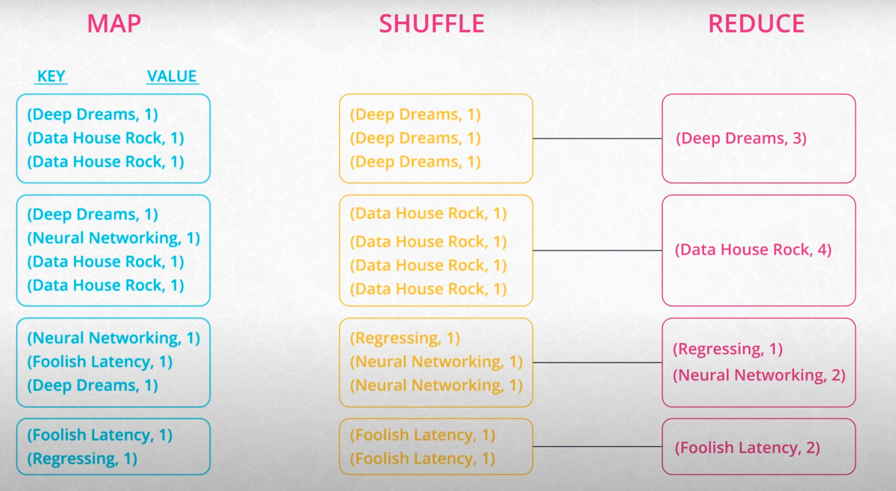
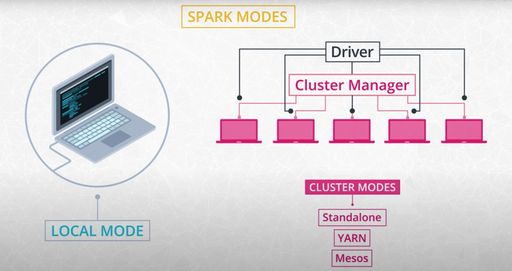

## Key Points
- What is big data?
- Review of the hardware behind big data
- Introduction to distributed systems
- Brief history of Spark and big data
- Common Spark use cases
- Other technologies in the big data ecosystem

#### Hadoop Vocabulary
- Here is a list of some terms associated with Hadoop. You'll learn more about these terms and how they relate to Spark in the rest of the lesson.
    - Hadoop - an ecosystem of tools for big data storage and data analysis. Hadoop is an older system than Spark but is still used by many companies. The major difference between Spark and Hadoop is how they use memory. Hadoop writes intermediate results to disk whereas Spark tries to keep data in memory whenever possible. This makes Spark faster for many use cases.
    - Hadoop MapReduce - a system for processing and analyzing large data sets in parallel.
    - Hadoop YARN - a resource manager that schedules jobs across a cluster. The manager keeps track of what computer resources are available and then assigns those resources to specific tasks.
    - Hadoop Distributed File System (HDFS) - a big data storage system that splits data into chunks and stores the chunks across a cluster of computers.
- As Hadoop matured, other tools were developed to make Hadoop easier to work with. These tools included:
    - Apache Pig - a SQL-like language that runs on top of Hadoop MapReduce
    - Apache Hive - another SQL-like interface that runs on top of Hadoop MapReduce
- Oftentimes when someone is talking about Hadoop in general terms, they are actually talking about Hadoop MapReduce. However, Hadoop is more than just MapReduce. In the next part of the lesson, you'll learn more about how MapReduce works.

#### How is Spark related to Hadoop?
- Spark, which is the main focus of this course, is another big data framework. Spark contains libraries for data analysis, machine learning, graph analysis, and streaming live data. Spark is generally faster than Hadoop. This is because Hadoop writes intermediate results to disk whereas Spark tries to keep intermediate results in memory whenever possible.
- The Hadoop ecosystem includes a distributed file storage system called HDFS (Hadoop Distributed File System). Spark, on the other hand, does not include a file storage system. You can use Spark on top of HDFS but you do not have to. Spark can read in data from other sources as well such as Amazon S3.

#### Streaming Data
- Data streaming is a specialized topic in big data. The use case is when you want to store and analyze data in real-time such as Facebook posts or Twitter tweets.
- Spark has a streaming library called Spark Streaming although it is not as popular and fast as some other streaming libraries. Other popular streaming libraries include Storm and Flink. Streaming won't be covered in this course, but you can follow these links to learn more about these technologies.

#### MapReduce
- MapReduce is a programming technique for manipulating large data sets. "Hadoop MapReduce" is a specific implementation of this programming technique.
- The technique works by first dividing up a large dataset and distributing the data across a cluster. In the map step, each data is analyzed and converted into a (key, value) pair. Then these key-value pairs are shuffled across the cluster so that all keys are on the same machine. In the reduce step, the values with the same keys are combined together.
- While Spark doesn't implement MapReduce, you can write Spark programs that behave in a similar way to the map-reduce paradigm. In the next section, you will run through a code example.

#### Spark Clusters in local mode and standalone modes

## Key Terms
- Beyond Spark for Storing and Processing Big Data
Keep in mind that Spark is not a data storage system, and there are a number of tools besides Spark that can be used to process and analyze large datasets.
    - HBase
    - Cassandra
    - Impala
    - Presto