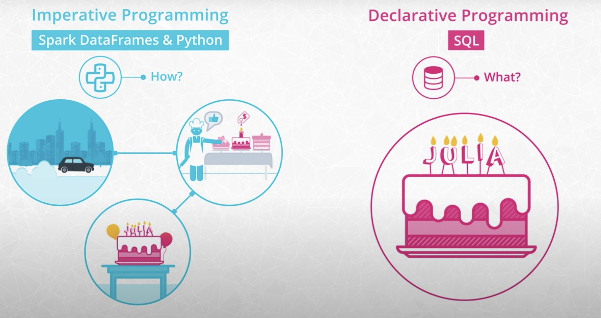

## Key Points
- Wrangling data with Spark
- Functional programming
- Read in and write out data
- Spark environment and Spark APIs
- RDD API

#### Functional Programming in Spark
- One of the hardest parts of learning Spark is becoming familiar with the functional style of programming. Under the hood, Spark is written in a functional programming language called Scala.
    - When you're programming with functional languages, you end up solving problems in a pretty different way than you would if you're using a general purpose language like Python.
    - Although Spark is written in Scala, you can use it with other languages like Java, R, and even Python. In this course, you'll be developing applications with the Python programming interface or PySpark for short.
- Even when you're using the PySpark API, you'll see the functional programming influence of Scala. For example, in the last lesson, you saw a MapReduce problem that counted up the number of times a song was played.
    - This code went through each record and spit out a tuple with the name of the song, and the number one.
    - The tuples were shuffled and reduced to a sum of the ones that came with each song name.
- If you're used to counting with For Loops and found that logic a little strange, it's because this was a functional approach to summing up songs
- In the procedural style that most Python programmers know, you'd use a counter variable to keep track of the play count for each song. Then you'd iterate through all the songs, and increment the counter by one if the song name matched.
- If you want to use Spark effectively, you'll have to get comfortable with a few tools from functional programming.

#### Why Spark Uses Functional Programming
- The core reason is that functional programming is perfect for distributed systems.
- Functional programming helps minimize mistakes that can cripple an entire distributed system.
- Functional programming gets its name from the functions you saw in your algebra class. - These functions are more strict than your average Python function because in math a function can only give you one answer when you give it an input. On the other hand, Python allows you to make some flexible, albeit complex, functions that depend on the input and other parameters.
- When you evaluate a mathematical function, you would never change the inputs of that function, but this is exactly what can happen in Python.

#### Lazy evaluation in the Spark DAG

#### Maps and Lambda Functions
- One of the most common functions in Spark is Maps. Maps simply make a copy of the original input data, and transform that copy according to whatever function you put inside the map. You can think about them as directions for the data telling each input how to get to the output.

#### Data Formats
The most common data formats you might come across are CSV, JSON, HTML, and XML.
- A CSV file or comma-separated values file, source tabular data in index format. Each line represents a record where fields are always in the same order defined usually by the first header. As the name suggests, the records are separated with a comma.
- JSON or JavaScript object notation storage records in attribute value pairs. The values may contain simple often numeric types or arrays.
- HTML or hypertext markup language, is a standard markup language for creating web pages and web applications. If you scrape data from the Internet, you will need to parse HTML.

#### Distributed Data Stores
- When we have so much data that we need distributed computing, the data itself often needs to be stored in a distributed way as well.
- Distributed file systems, storage services, and distributed databases store data in a fault-tolerant way. So if a machine breaks or becomes unavailable, we don't lose the information we have collected.
- Hadoop has a Distributed File System, HDFS, to store data. HDFS splits files into 64 or 128 megabyte blocks and replicates these blocks across the cluster. This way, the data is stored in a fault tolerant way and can be accessed in digestible chunks.
- If you don't want to maintain your own cluster, we can use many services such as the Amazon Simple Storage Service or S3. Companies using AWS or Amazon Web Services often use S3 to store the raw data they have collected.

#### The SparkSession
- The first component of each Spark Program is the SparkContext. The SparkContext is the main entry point for Spark functionality and connects the cluster with the application.
- To create a SparkContext, we first need a SparkConf object to specify some information about the application such as its name and the master's nodes' IP address. If we run Spark in local mode, we can just put the string local as master.
- To read data frames, we need to use Spark SQL equivalent, the SparkSession.
- Similarity to the SparkConf, we can specify some parameters to create a SparkSession.
    - getOrCreate() for example, means that if you already have a SparkSession running, instead of creating a new one, the old one will be returned and its parameters will be modified to the new configurations.

#### Imperative VS Declarative Programming
- We will cover two different ways to manipulate our data:
- Imperative programming using DataFrames and Python
    - Imperative programming is concerned with the How
    - Let's get in the car, drive two miles down the road to my favorite bakery, go into the shop, select the cake from the counter, purchase the cake, and then drive home.
    - Focus on the exact steps, how we get to the result
    - Data transformations with DataFrames
- Declarative programming using SQL
    - Cares about the What
    - Let's get the cake for Julia.
    - Concerned about the result we want to achieve
    - Abstraction layer of an imperative system
- If you have used pandas DataFrames before, you are probably familiar with how to manipulate DataFrames programmatically. We can chain methods such as filter and group by one after another, transforming the DataFrame further and further. In the next few videos, we will dive into how to do data transformations with DataFrames and imperative programming.

#### Functions
- In the previous video, we've used a number of functions to manipulate our dataframe. Let's take a look at the different type of functions and their potential pitfalls.

##### General functions
We have used the following general functions that are quite similar to methods of pandas dataframes:
- select(): returns a new DataFrame with the selected columns
- filter(): filters rows using the given condition
- where(): is just an alias for filter()
- groupBy(): groups the DataFrame using the specified columns, so we can run aggregation on them
- sort(): returns a new DataFrame sorted by the specified column(s). By default the second parameter 'ascending' is True.
- dropDuplicates(): returns a new DataFrame with unique rows based on all or just a subset of columns
- withColumn(): returns a new DataFrame by adding a column or replacing the existing column that has the same name. The first parameter is the name of the new column, the second is an expression of how to compute it.

##### Aggregate functions
- Spark SQL provides built-in methods for the most common aggregations such as count(), countDistinct(), avg(), max(), min(), etc. in the pyspark.sql.functions module. These methods are not the same as the built-in methods in the Python Standard Library, where we can find min() for example as well, hence you need to be careful not to use them interchangeably.
- In many cases, there are multiple ways to express the same aggregations. For example, if we would like to compute one type of aggregate for one or more columns of the DataFrame we can just simply chain the aggregate method after a groupBy(). If we would like to use different functions on different columns, agg()comes in handy. For example agg({"salary": "avg", "age": "max"}) computes the average salary and maximum age.

##### User defined functions (UDF)
- In Spark SQL we can define our own functions with the udf method from the pyspark.sql.functions module. The default type of the returned variable for UDFs is string. If we would like to return an other type we need to explicitly do so by using the different types from the pyspark.sql.types module.

##### Window functions
- Window functions are a way of combining the values of ranges of rows in a DataFrame. When defining the window we can choose how to sort and group (with the partitionBy method) the rows and how wide of a window we'd like to use (described by rangeBetween or rowsBetween).

#### Spark SQL
- Next, you'll learn to query data with a declarative approach. Spark comes with a SQL library that lets you query DataFrames using the same SQL syntax you'd use in a tool like MySQL or Postgres.
- You'll be able to share your Spark code with a wider community, since many analysts and data scientists prefer using SQL.
- Spark automatically optimizes your SQL code, to speed up the process of manipulating and retrieving data.
- To follow the cake analogy, you simply tell your program to bake a cake, and Spark SQL will give you a great cake even if you don't detail the exact steps.

#### Resilient Distributed Datasets (RDDs)
- RDDs are a low-level abstraction of the data. In the first version of Spark, you worked directly with RDDs. You can think of RDDs as long lists distributed across various machines. You can still use RDDs as part of your Spark code although data frames and SQL are easier. This course won't go into the details of RDD syntax, but you can find some further explanation of the difference between RDDs and DataFrames in [Databricks' A Tale of Three Apache Spark APIs: RDDs, DataFrames, and Datasets](https://www.databricks.com/blog/2016/07/14/a-tale-of-three-apache-spark-apis-rdds-dataframes-and-datasets.html) blog post.

