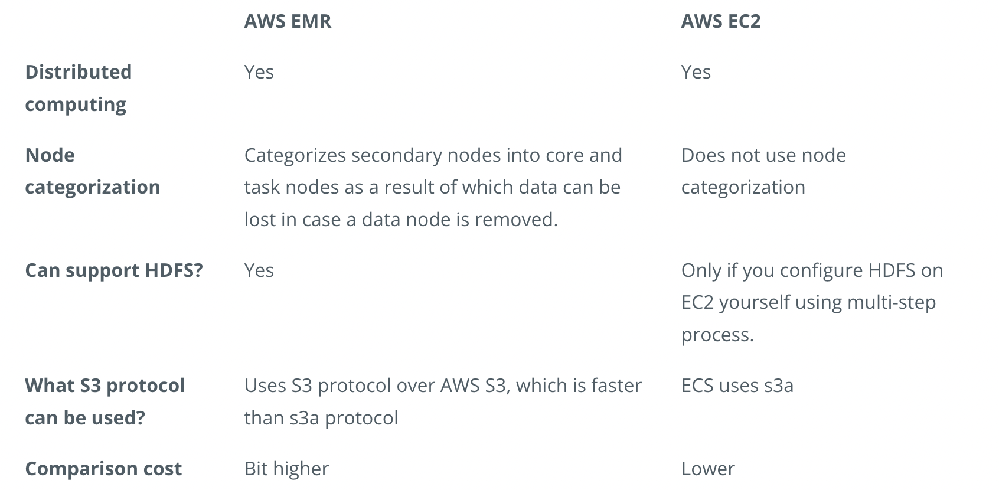

## Key Terms
- Distinguish between setting up a Spark Cluster using both Local and Standalone Mode
- Set up Spark Cluster in AWS
- Use Spark UI
- Use AWS CLI
- Create EMR using AWS CLI
- Create EMR Cluster
- Test Port Forwarding
- Use Notebooks on your Spark Cluster
- Write Spark Scripts
- Store and Retrieve data on the Cloud
- Read and Write to Amazon S3
- Understand the distinction between HDFS and S3
- Reading and Writing Data to HDFS

#### Overview of the Set up of a Spark Cluster
- Amazon S3 will store the dataset.
We rent a cluster of machines, i.e., our Spark Cluster, and iti s located in AWS data centers. We rent these using AWS service called Elastic Compute Cloud (EC2).
    - We log in from your local computer to this Spark cluster.
    - Upon running our Spark code, the cluster will load the dataset from Amazon S3 into the cluster’s memory distributed across each machine in the cluster.
- New Terms:
    - Local mode: You are running a Spark program on your laptop like a single machine.
    - Standalone mode: You are defining Spark Primary and Secondary to work on your (virtual) machine. You can do this on EMR or your machine. Standalone mode uses a resource manager like YARN or Mesos.

#### Using Spark on AWS
When you want to rent a cluster of machines on AWS to run Spark, you have 2 choices:
- Use AWS Elastic Compute (EC2) machines and install and configure Spark and HDFS yourself
- Use the AWS EMR service (previously called Elastic MapReduce), which is a scalable set of EC2 machines that are already configured to run Spark

##### Circling Back on HDFS
- Since Spark does not have its own distributed storage system, it leverages using HDFS or AWS S3, or any other distributed storage. Primarily in this course, we will be using AWS S3, but let’s review the advantages of using HDFS over AWS S3.

##### What is HDFS?
- HDFS (Hadoop Distributed File System) is the file system in the Hadoop ecosystem. Hadoop and Spark are two frameworks providing tools for carrying out big-data related tasks. While Spark is faster than Hadoop, Spark has one drawback. It lacks a distributed storage system. In other words, Spark lacks a system to organize, store and process data files.

##### MapReduce System
- HDFS uses MapReduce system as a resource manager to allow the distribution of the files across the hard drives within the cluster. Think of it as the MapReduce System storing the data back on the hard drives after completing all the tasks.
- Spark, on the other hand, runs the operations and holds the data in the RAM memory rather than the hard drives used by HDFS. Since Spark lacks a file distribution system to organize, store and process data files, Spark tools are often installed on Hadoop because Spark can then use the Hadoop Distributed File System (HDFS).

##### Why Would You Use an EMR Cluster?
- Since a Spark cluster includes multiple machines, in order to use Spark code on each machine, we would need to download and install Spark and its dependencies. This is a manual process. AWS EMR is a service that negates the need for you, the user, to go through the manual process of installing Spark and its dependencies for each machine.
- Setting up EMR Clusters on AWS
The next part of the lesson will demonstrate how to create an EMR Cluster from the AWS Console, and from the AWS CLI. Review the AWS documentation to set up an EMR Cluster

#### Differences between HDFS and AWS S3
Since Spark does not have its own distributed storage system, it leverages HDFS or AWS S3, or any other distributed storage. Primarily in this course, we will be using AWS S3, but let’s review the advantages of using HDFS over AWS S3.
- AWS S3 is an object storage system that stores the data using key value pairs, and HDFS is an actual distributed file system that guarantees fault tolerance. HDFS achieves fault tolerance by duplicating the same files at 3 different nodes across the cluster by default (it can be configured to reduce or increase this duplication).
- HDFS has traditionally been installed in on-premise systems which had engineers on-site to maintain and troubleshoot the Hadoop Ecosystem, costing more than storing data in the cloud. Due to the flexibility of location and reduced cost of maintenance, cloud solutions have been more popular. With the extensive services AWS provides, S3 has been a more popular choice than HDFS.
- Since AWS S3 is a binary object store, it can store all kinds of formats, even images and videos. HDFS strictly requires a file format - the popular choices are avro and parquet, which have relatively high compression rates making it useful for storing large datasets.

#### Jupyter / Zeppelin Notebook
There are a couple of options for which notebook to use. We can use a Jupyter Notebook, or use a Zeppelin notebook. If you are already familiar with Jupyter Notebooks, continue using them.
- Advantages of using Zeppelin Notebook
While the use of Jupyter Notebook is common across the industry, you can explore using Zeppelin notebooks. Zeppelin notebooks have been available since EMR 5.x versions, and they have direct access to Spark Context, such as a local spark-shell. For example, if you type sc, you’ll be able to get Spark Context within Zeppelin notebooks.
- Zeppelin is very similar to Jupyter Notebook, but if you want to use other languages like Scala or SQL, on top of using Python, you can use Zeppelin instead.

#### Spark Scripts
- Jupyter notebooks are great for prototyping as well as exploring and visualizing your data. However, Jupyter notebooks aren't the best tool for automating your workflow, that's where Python scripts come into play.
- Imagine you work for a social media company that receives a constant stream of text, image, and video data from your users. To keep up with your users, you want your Spark jobs to run automatically at specific intervals, perhaps once every hour. These Spark jobs give your entire team the latest information on their users and will probably become so useful to your team that they will start to request more and more Spark jobs. You won't want to manually run a growing collection of notebooks, you'll want automated scripts that you can set and forget. Let's learn how to rework your Jupyter notebooks into Python scripts and submit these scripts to your cluster from the command line.

#### Using S3 to Read and Write Data
- We now have a cluster running on AWS and we can submit our Spark programs directly through the command line. How can we read and write data to long-term storage in the cloud?
- One of the most common places to store big data sets is Amazon's Simple Storage Service or S3 for short. Amazon S3 is a safe, easy, and cheap place to store big data. Amazon does all the work of maintaining the hardware, keeping backups, and making sure the data is almost always available. You can think about it like Dropbox or iCloud for your big data. You don't need to worry about the details of how S3 works, the Amazon engineers take care of that. You just need to know how to use S3 with Spark. So, next, we will show you how to store data in S3 and then retrieve the data for your Spark program.

#### Differences between HDFS and AWS S3
- Since Spark does not have its own distributed storage system, it leverages HDFS or AWS S3, or any other distributed storage. Primarily in this course, we will be using AWS S3, but let’s review the advantages of using HDFS over AWS S3.
    - AWS S3 is an object storage system that stores the data using key value pairs, and HDFS is an actual distributed file system that guarantees fault tolerance. HDFS achieves fault tolerance by duplicating the same files at 3 different nodes across the cluster by default (it can be configured to reduce or increase this duplication).
    - HDFS has traditionally been installed in on-premise systems which had engineers on-site to maintain and troubleshoot the Hadoop Ecosystem, costing more than storing data in the cloud. Due to the flexibility of location and reduced cost of maintenance, cloud solutions have been more popular. With the extensive services AWS provides, S3 has been a more popular choice than HDFS.
    - Since AWS S3 is a binary object store, it can store all kinds of formats, even images and videos. HDFS strictly requires a file format - the popular choices are avro and parquet, which have relatively high compression rates making it useful for storing large datasets.

