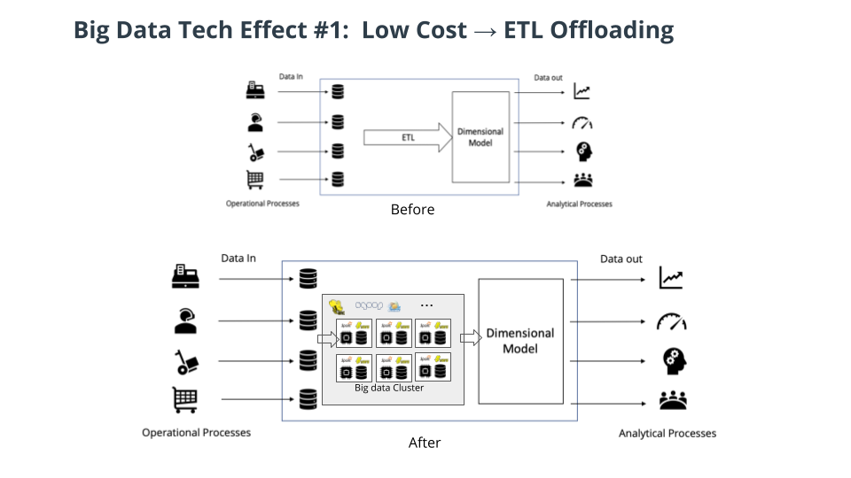
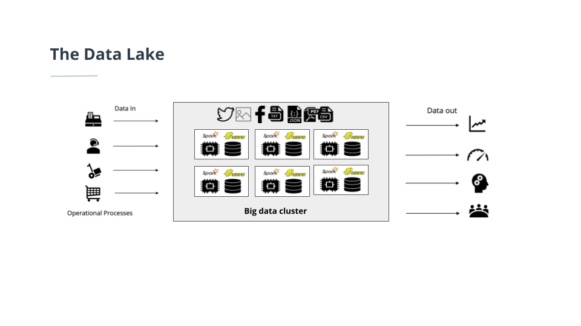
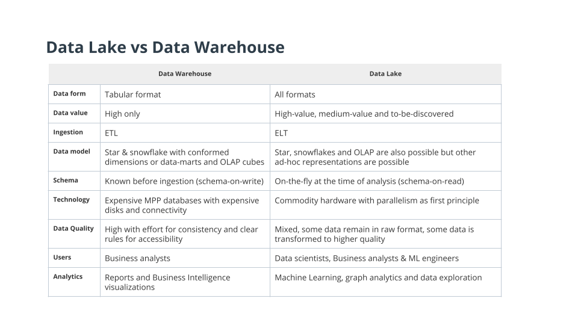
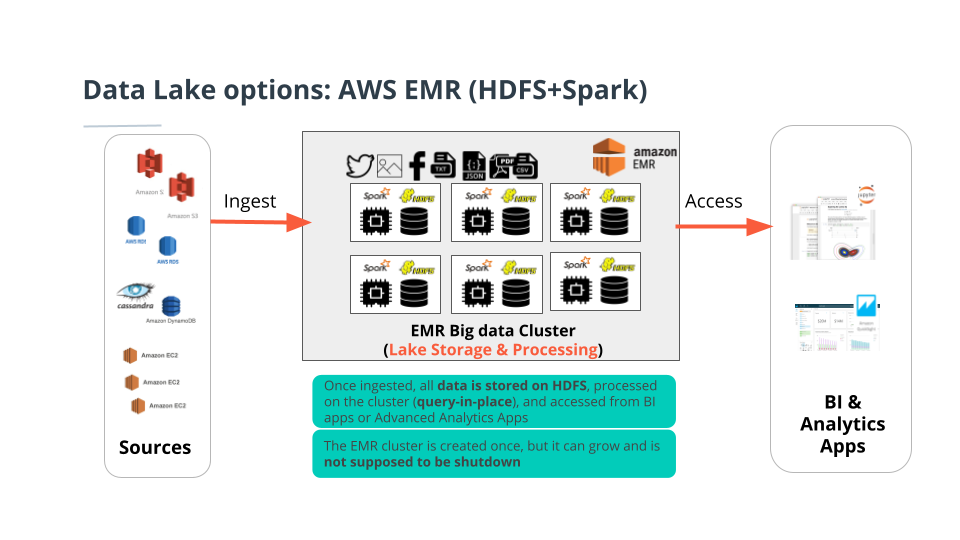
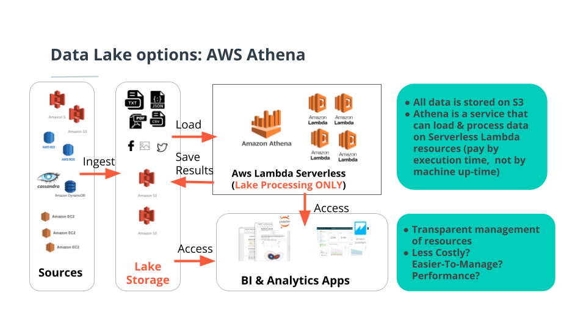

## Key Points
- Make the case for data lakes
- How data lakes are different from a data warehouse
- The various options for implementing data lakes on AWS.
- How data lakes work
- Issues with data lakes.

#### Why Data Lakes?
- The Data Warehouse is mature, and modeling is extremely relevant to this day.
    - Many organizations still use data warehouses
- What has driven the need for data lakes?
    - The abundance of unstructured data drives data lake adoption.
    - The rise of big data technologies like HDFS and Spark.
    - Types of analyses like predictive analytics based on machine learning and recommended systems and graph analytics drive data lake use.

#### The extraction of unstructured data into Data Warehouses is too much of a strong commitment
- Take the example of Facebook comments:
    - Initially, you might be interested in the number of replies
    - Then you would be interested in the frequency of angry words.
- This data is not like fact and dimension data modeling when you have clear additive facts and group by dimensions
- With the rise of Big Data Technologies, it became possible to store petabytes of data on commodity hardware using HDFS and process it with tools of the Hadoop ecosystem.
- A convenient property of Big Data Technologies is **Schema-On-Read**,
- Load a CSV file and make query on it without really creating tables, inserting data, and going through a long tedious process.
- This is useful for processing unstructured or unstructured data in general.

#### New Roles and Advanced Analytics
- It's becoming more popular to engage new roles like the data scientist, who's going to extract value from data. The data scientist's job is almost impossible if they have to work with a fixed data representation. There needs to be freedom to explore datasets.
- Advanced analytics, machine learning, and natural language processing also drive the use of data lakes. These types of analytics are hard to do in the data warehouse.
- The data lake shares the same goals of the data warehouse of supporting business insights beyond the day-to-day transaction handling. However, it is there to provide what the data warehouse could not achieve.

#### The Effects of Big Data
What are the aspects of big data technology that had a direct effect on the transition from data warehouses to data lakes?
- ETL Replacement
    - Big data clusters replace ETL Grids
    - Big data clusters use the same hardware for storage and processing
- Adding storage into the warehouse with less cost
    - The low cost to store data of low or unknown value, that would otherwise be expensive to put in the dimensional model store a data warehouse uses.

#### Schema on Read
- Second thing which we want to look at in the big data technologies is the schema-on-read. So, traditionally I mean if I will give you the choice today to try to query the data, any data, just even tabular data on a database or in plain files, what would you choose? Naturally, you would choose the database. It's much easier to just run a SQL query. However, the big data tools in the Hadoop ecosystem, the processing tools like Hive and Spark and so on,
- Big data tools like Hadoop, Hive, and Spark made it easy to work with plain files that were not inserted into the database. Schema on Read is when the schema of a file is either inferred or specified, but the data is not inserted into a database. Tools like Hadoop, Hive, and Spark point to the data in the schema, check against the schema and allow you to work with it.
- Once the data is pointed to by a schema, inferred or specified, and it's loaded into a data frame, you can do direct querying without databases or database insertions. You can write SQL by just taking a data frame and registering it as a table.

#### Unstructured and Semi-Structured Data Support
An important effect of big data technologies is the ability to read many text formats like CSV, JSON, and binary formats. Other formats supported include:
- Parquet format: is a columnar storage format
- Data in compressed formats like Gzip with control over the compression ratio versus the speed of decompression
- Reading from HDFS or S3
- Data doesn't need to reside in file systems, it can reside in databases. You can load a DataFrame from a JDBC connection or SQL databases
- NoSQL databases you can connect and load into DataFrames, which you can work with using SQL.

#### Implementing Data Lakes
- Data lakes are empowered by big data technologies. Initially, big data technologies used the Hadoop ecosystem.
- Over time, big data tools changed and Hadoop is not the only way to implement big data architectures. In the next section, we will explain the different ways of implementing a data lake on Amazon Web Services.

#### Data Lake Concepts
- All data is welcomed, unstructured and semi-structured
- You don't do Extract Transform and Load (ETL). You do ELT
    - Data is stored in its original format, without transformation, and is transformed later.
- Distributed data storage out of the box.
    - Spark and RDD are distributed data storage

#### Data Lakes vs Data Warehouses

#### Data Lake Options on AWS
- How can you implement a data lake using Amazon Web Services?
- What are the storage options?
    - Storage with HDFS
    - Storage with S3
- What are the processing option?
    - Processing with Spark
    - Processing with Hive
    - Processing with Flink
    - Serverless processing
- Choose unmanaged or managed vendor solutions:
    - AWS Elastic MapReduce (EMR) is an AWS managed solution. EMR uses HDFS or S3 with Spark in a cluster, and that cluster is elastic. You can shrink or grow it.
    - Other vendors like Cloudera, Hortonworks, and Databricks will give you also solutions to work with on EC2 machines.

#### Data Lake options with AWS EMR with HDFS and Spark

#### Data Lake options with AWS EMR using S3 and Spark

#### Data Lake options with AWS Athena using Serverless processing

#### Data Lake Issues
- Abusing the amount of data in the data lake.
- Data governance issues
- Should the data lake replace the data warehouse? Should they work together?

