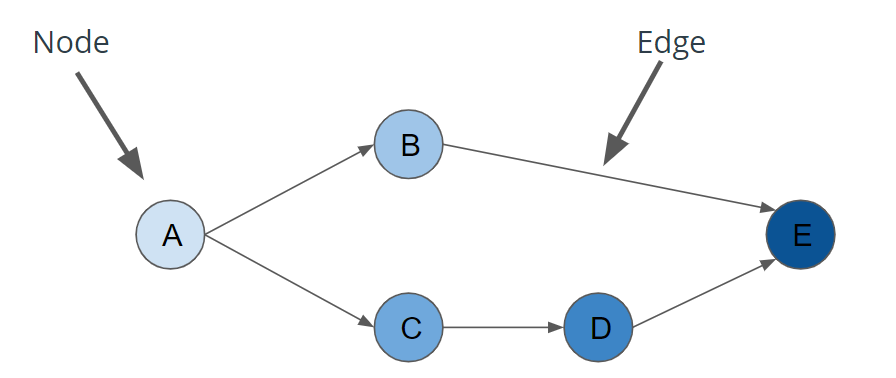
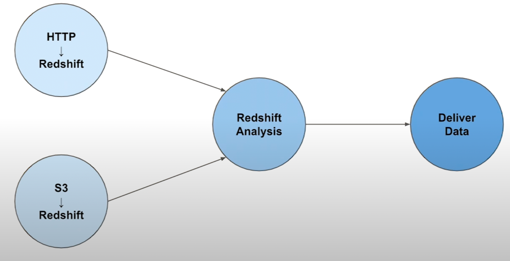
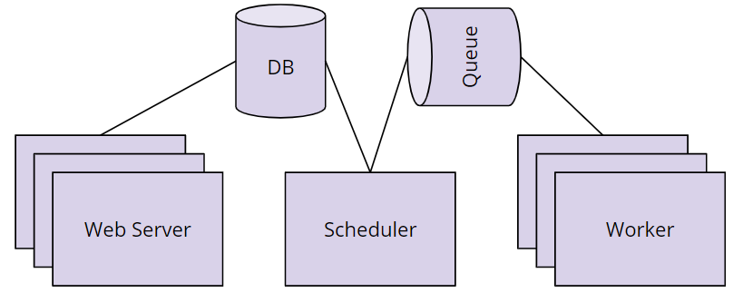
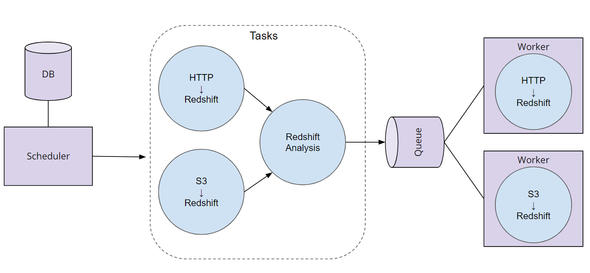

## Key Terms
In this lesson, you'll learn more about data pipelines and how they can be represented as Directed Acyclic Graphs (DAGs). We'll also cover:
- Data validation
- How Apache Airflow uses DAGs
- How Airflow works
- Schedules in Airflow
- Operators and Tasks in Airflow
- Connections and Hooks in Airflow
- Context and Templating in Airflow

We'll end the lesson by building an AWS S3 to Redshift DAG

Diagram of a Directed Acyclic Graph


#### Definitions
- Directed Acyclic Graphs (DAGs): DAGs are a special subset of graphs in which the edges between nodes have a specific direction, and no cycles exist. When we say “no cycles exist” what we mean is the nodes can't create a path back to themselves.
- Nodes: A step in the data pipeline process.
- Edges: The dependencies or relationships other between nodes.

#### Common Questions
- Are there real world cases where a data pipeline is not DAG?
    - It is possible to model a data pipeline that is not a DAG, meaning that it contains a cycle within the process. However, the vast majority of use cases for data pipelines can be described as a directed acyclic graph (DAG). This makes the code more understandable and maintainable.
- Can we have two different pipelines for the same data and can we merge them back together?
    - Yes. It's not uncommon for a data pipeline to take the same dataset, perform two different processes to analyze the it, then merge the results of those two processes back together.

#### Bike Share DAG



#### Data Validation
- Data Validation is the process of ensuring that data is present, correct & meaningful. Ensuring the quality of your data through automated validation checks is a critical step in building data pipelines at any organization.

#### Apache Airflow
- "Airflow is a platform to programmatically author, schedule and monitor workflows. Use airflow to author workflows as directed acyclic graphs (DAGs) of tasks. The airflow scheduler executes your tasks on an array of workers while following the specified dependencies. Rich command line utilities make performing complex surgeries on DAGs a snap. The rich user interface makes it easy to visualize pipelines running in production, monitor progress, and troubleshoot issues when needed. When workflows are defined as code, they become more maintainable, versionable, testable, and collaborative."

#### Tips for Using Airflow's Web Server
- Use Google Chrome to view the Web Server. Airflow sometimes has issues rendering correctly in Firefox or other browers.
- Make sure you toggle the DAG to On before you try an run it. Otherwise you'll see your DAG running, but it won't ever finish.
- After you have updated the DAG, you will need to run 
```
/opt/airflow/start.sh 
```
command in the terminal of the workspace on the next page to start the Airflow webserver. 

#### Callables 
- Callables can also be thought of as passing functions that can be included as arguments to other functions. Examples of callables are map, reduce, filter. This is a pretty powerful feature of python you can explore more using the resources below. Callables are examples of functional programming that is introduced in an earlier lesson.

#### Airflow component diagram


- Scheduler orchestrates the execution of jobs on a trigger or schedule. The Scheduler chooses how to prioritize the running and execution of tasks within the system. You can learn more about the Scheduler from the official Apache Airflow documentation.
- Work Queue is used by the scheduler in most Airflow installations to deliver tasks that need to be run to the Workers.
- Worker processes execute the operations defined in each DAG. In most Airflow installations, workers pull from the work queue when it is ready to process a task. When the worker completes the execution of the task, it will attempt to process more work from the work queue until there is no further work remaining. When work in the queue arrives, the worker will begin to process it.
- Database saves credentials, connections, history, and configuration. The database, often referred to as the metadata database, also stores the state of all tasks in the system. Airflow components interact with the database with the Python ORM, SQLAlchemy.
- Web Interface provides a control dashboard for users and maintainers. Throughout this course you will see how the web interface allows users to perform tasks such as stopping and starting DAGs, retrying failed tasks, configuring credentials, The web interface is built using the Flask web-development microframework.

#### Diagram of how Airflow works


Order of Operations For an Airflow DAG
- The Airflow Scheduler starts DAGs based on time or external triggers.
- Once a DAG is started, the Scheduler looks at the steps within the DAG and determines which steps can run by looking at their dependencies.
- The Scheduler places runnable steps in the queue.
- Workers pick up those tasks and run them.
- Once the worker has finished running the step, the final status of the task is recorded and additional tasks are placed by the scheduler until all tasks are complete.
- Once all tasks have been completed, the DAG is complete.

#### Creating a DAG
Creating a DAG is easy. Give it a name, a description, a start date, and an interval.
```
from airflow import DAG

divvy_dag = DAG(
    'divvy',
    description='Analyzes Divvy Bikeshare Data',
    start_date=datetime(2019, 2, 4),
    schedule_interval='@daily')
```

#### Creating Operators to Perform Tasks
Operators define the atomic steps of work that make up a DAG. Instantiated operators are referred to as Tasks.
```
from airflow import DAG
from airflow.operators.python_operator import PythonOperator

def hello_world():
    print(“Hello World”)

divvy_dag = DAG(...)
task = PythonOperator(
    task_id=’hello_world’,
    python_callable=hello_world,
    dag=divvy_dag)
```

#### Schedules
- Schedules are optional, and may be defined with cron strings or Airflow Presets. Airflow provides the following presets:
    - @once - Run a DAG once and then never again
    - @hourly - Run the DAG every hour
    - @daily - Run the DAG every day
    - @weekly - Run the DAG every week
    - @monthly - Run the DAG every month
    - @yearly- Run the DAG every year
    - None - Only run the DAG when the user initiates it
- Start Date: If your start date is in the past, Airflow will run your DAG as many times as there are schedule intervals between that start date and the current date.
- End Date: Unless you specify an optional end date, Airflow will continue to run your DAGs until you disable or delete the DAG.

#### Operators
Operators define the atomic steps of work that make up a DAG. Airflow comes with many Operators that can perform common operations. Here are a handful of common ones:
- PythonOperator
- PostgresOperator
- RedshiftToS3Operator
- S3ToRedshiftOperator
- BashOperator
- SimpleHttpOperator
- Sensor

#### Task Dependencies
- In Airflow DAGs:
    - Nodes = Tasks
    - Edges = Ordering and dependencies between tasks
- Task dependencies can be described programmatically in Airflow using >> and <<
    - a >> b means a comes before b
    - a << b means a comes after b
```
hello_world_task = PythonOperator(task_id=’hello_world’, ...)
goodbye_world_task = PythonOperator(task_id=’goodbye_world’, ...)
...
# Use >> to denote that goodbye_world_task depends on hello_world_task
hello_world_task >> goodbye_world_task
```
- Tasks dependencies can also be set with “set_downstream” and “set_upstream”
    - a.set_downstream(b) means a comes before b
    - a.set_upstream(b) means a comes after b
```
hello_world_task = PythonOperator(task_id=’hello_world’, ...)
goodbye_world_task = PythonOperator(task_id=’goodbye_world’, ...)
...
hello_world_task.set_downstream(goodbye_world_task)
```

#### Connection via Airflow Hooks
- Connections can be accessed in code via hooks. Hooks provide a reusable interface to external systems and databases. With hooks, you don’t have to worry about how and where to store these connection strings and secrets in your code.
```
from airflow import DAG
from airflow.hooks.postgres_hook import PostgresHook
from airflow.operators.python_operator import PythonOperator

def load():
# Create a PostgresHook option using the `demo` connection
    db_hook = PostgresHook(‘demo’)
    df = db_hook.get_pandas_df('SELECT * FROM rides')
    print(f'Successfully used PostgresHook to return {len(df)} records')

load_task = PythonOperator(task_id=’load’, python_callable=hello_world, ...)
```
- Airflow comes with many Hooks that can integrate with common systems. Here are a few common ones:
    - HttpHook
    - PostgresHook (works with RedShift)
    - MySqlHook
    - SlackHook
    - PrestoHook
    
## Key Points